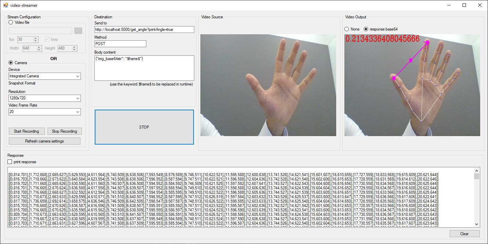

# FastAPI / MediaPipe / Hand Detection

This is a Python web-server application with some endpoints that receive an image converted to base64 and perform some hand analysis on the image.

(The image above show a Windows application (not in this repo) sending webcam images to this webserver)

(The example in the image above is measuring the angle between my thumb and my index finger)

## What is FastAPI

FastAPI is a modern, fast (high-performance), web framework for building APIs with Python 3.6+ based on standard Python type hints.

The key features are:

- Fast: Very high performance, on par with NodeJS and Go (thanks to Starlette and Pydantic). One of the fastest Python frameworks available.

- Fast to code: Increase the speed to develop features by about 200% to 300% *.

- Fewer bugs: Reduce about 40% of human (developer) induced errors. *

- Intuitive: Great editor support. Completion everywhere. Less time debugging.

- Easy: Designed to be easy to use and learn. Less time reading docs.

- Short: Minimize code duplication. Multiple features from each parameter declaration. Fewer bugs.

- Robust: Get production-ready code. With automatic interactive documentation.

- Standards-based: Based on (and fully compatible with) the open standards for APIs: OpenAPI (previously known as Swagger) and JSON Schema.

_For more details check [FastAPI on GitHub](https://github.com/tiangolo/fastapi)._

## what is MediaPipe

MediaPipe is a an open-source framework from Google for building multimodal (eg. video, audio, any time series data), cross platform (i.e Android, iOS, web, edge devices) applied ML pipelines. It is performance optimized with end-to-end ondevice inference in mind.

(In this application we will only use some of the hands features)

_For more details check [MediaPipe](https://google.github.io/mediapipe/)._
